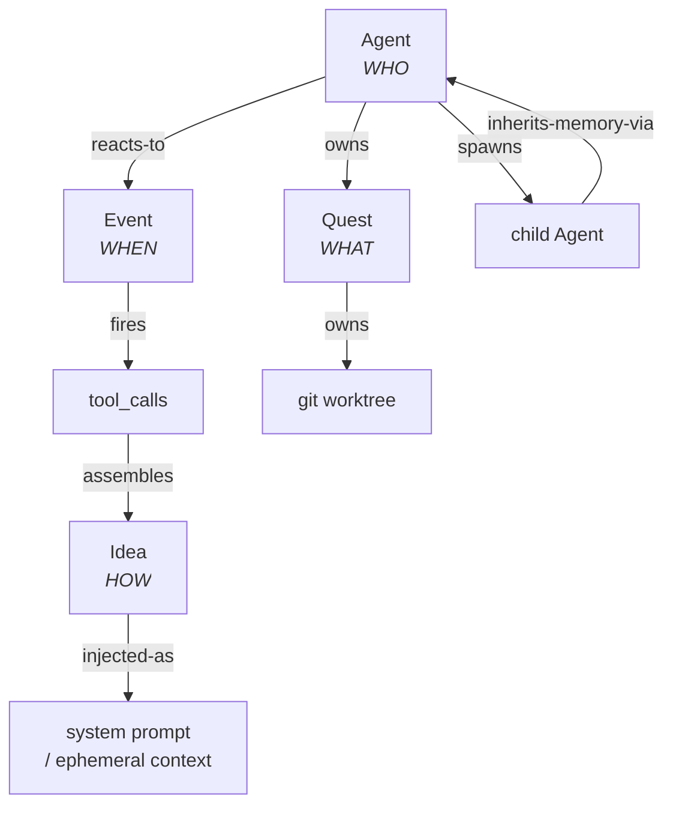
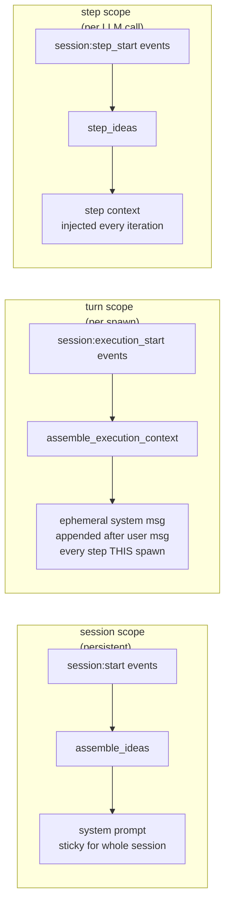
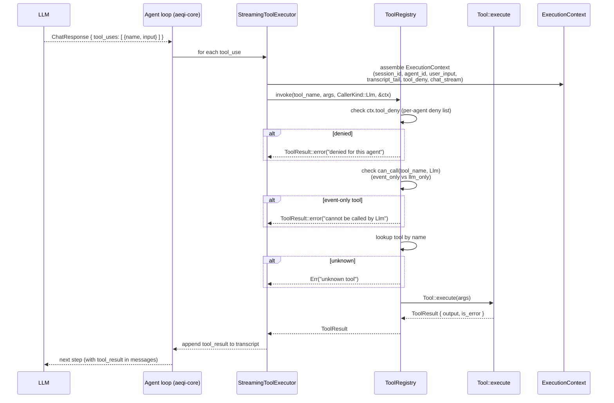
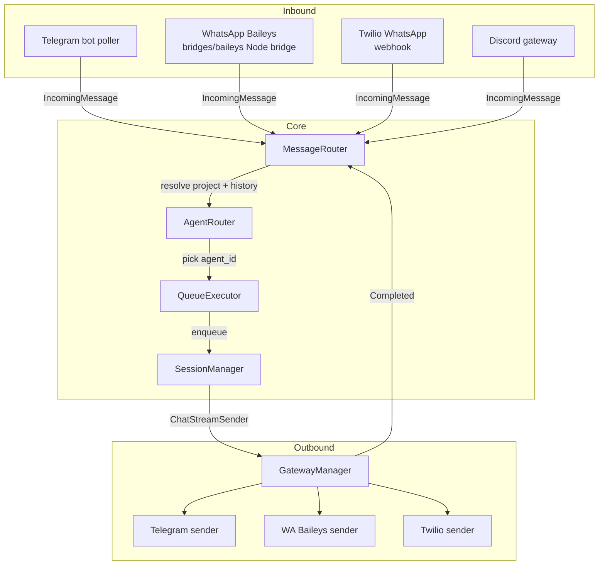

# AEQI Architecture

> AEQI is an autonomous company runtime. A user describes a goal; AEQI spawns a
> root agent for that goal and evolves around it — creating sub-agents, quests,
> ideas, and events as it works. This document is the reference for how that
> runtime is wired.

New-engineer reading path: skim the **Four primitives**, then **Session lifecycle**,
then **Event firing path**. The rest is lookup material.

---

## 1. Four primitives

Everything in AEQI reduces to four primitives. Each answers one W-question.

| Primitive | W | Role | Storage |
|-----------|---|------|---------|
| **Agent** | WHO | Actor. A company is a root agent; every sub-agent is an agent too. | `aeqi.db:agents` |
| **Event** | WHEN | Trigger / reaction rule. Pattern + tool_calls + cooldown. Not a log. | `aeqi.db:events` |
| **Quest** | WHAT | Structured work unit with a goal and its own git worktree. | `aeqi.db:tasks` |
| **Idea** | HOW | Instructions, memory, strategy. Knowledge injected into the LLM. | `aeqi.db:ideas` (FTS5 + vector) |



Rules:
- An agent with `parent_id IS NULL` is a **root agent** — the user-facing company.
- A quest owns a worktree; a session owns nothing (it's an execution of an agent against a quest).
- An event has a `pattern` (e.g. `session:start`, `schedule:0 9 * * *`, `webhook:abc`) and a list of `tool_calls` that run when it fires. Legacy `idea_ids`/`query_template` columns still work as fallback when `tool_calls` is empty.
- Ideas carry `Vec<String>` tags (no category field). Assembly is event-driven: ideas enter the prompt because some event referenced them, not because of ad-hoc rules.

Canonical loop: *event fires → agent wakes → ideas assemble → quest picked up → executed → new events emitted → loop*.

Source anchors:
- Agent struct: `crates/aeqi-orchestrator/src/agent_registry.rs:34`
- Event + ToolCall: `crates/aeqi-orchestrator/src/event_handler.rs:21`
- Idea trait: `crates/aeqi-core/src/traits` + `crates/aeqi-ideas`
- Quest: `crates/aeqi-quests/`

---

## 2. Session lifecycle

A **session** is not an in-memory entity. It is durable state in `sessions.db`
plus, while one turn is running, a live `ExecutionHandle` held by the
`QueueExecutor`. The `SessionManager` is stateless — it builds agents on
demand and spawns them.

Three lifecycle scopes, each backed by its own event pattern:

| Scope | Pattern | Fires | Purpose |
|-------|---------|-------|---------|
| session (birth) | `session:start` | once, at session creation | foundational system prompt (identity, role) |
| turn (per spawn) | `session:execution_start` | every spawn, including resumes | per-turn refresh context |
| step (per LLM iter) | `session:step_start` | every LLM call inside a turn | step-level context (current status, clock) |
| stop | `session:stopped` | when a turn finishes/errors | cleanup, notifications |

### 2a. Birth → spawn step → stop

```mermaid
sequenceDiagram
  autonumber
  participant U as User / Channel
  participant D as Daemon / IPC
  participant QE as QueueExecutor
  participant SM as SessionManager
  participant EH as EventHandlerStore
  participant IA as idea_assembly
  participant AG as Agent (aeqi-core)
  participant P as LLM Provider

  U->>D: incoming message (chat/telegram/wa)
  D->>QE: enqueue(session_id, prompt)
  QE->>SM: spawn_session(agent_id, prompt, provider, opts)

  Note over SM,IA: session:start — ONCE per session
  SM->>EH: get_events_for_pattern("session:start", agent)
  SM->>IA: assemble_ideas(session:start)
  IA->>IA: walk ancestor chain, run event tool_calls<br/>(ideas.assemble, ideas.search, …)
  IA-->>SM: AssembledPrompt { system, tool_restrictions }

  Note over SM,IA: session:execution_start — EVERY spawn (turn)
  SM->>IA: assemble_execution_context(session:execution_start)
  IA-->>SM: ephemeral system prompt (this turn only)

  SM->>EH: step_events = events for "session:step_start"
  SM->>AG: Agent::new(config, provider, tools, observer, system_prompt)<br/>.with_step_ideas(…)<br/>.with_step_events(…)<br/>.with_execution_context(…)<br/>.with_pattern_dispatcher(…)
  SM-->>QE: SpawnedSession { join_handle, stream, sandbox }

  loop agent.run — iterate until stop
    AG->>AG: StepStart → emit EventFired(session:step_start)<br/>inject step_ideas + execution_context
    AG->>P: ChatRequest(messages, tools)
    P-->>AG: ChatResponse (text / tool_uses / stop_reason)
    alt tool_use
      AG->>AG: ToolRegistry.invoke(name, args, CallerKind::Llm, ctx)
      AG-->>AG: feed ToolResult back into transcript
    else context budget exceeded
      AG->>AG: PatternDispatcher.dispatch("context:budget:exceeded")
      Note right of AG: delegates to configured event<br/>(session.spawn compactor + transcript.replace_middle);<br/>falls back to inline compaction if no event
    end
  end

  AG-->>SM: AgentResult { text, stop_reason, usage }
  SM-->>QE: join_handle resolves
  QE->>EH: fire session:stopped events
  QE->>D: persist final transcript, release execution lock
```

Key implementation points:

- The `session_id` is pre-generated before any DB writes so the per-session
  execution lock can be acquired (`crates/aeqi-orchestrator/src/session_manager.rs:400`).
  Two rapid-fire spawns for the same session serialize here.
- `with_pattern_dispatcher` wires the `EventPatternDispatcher` so
  `context:budget:exceeded` can delegate compaction to a configured event
  (normally `session.spawn { kind: "compactor" }` + `transcript.replace_middle`).
  Inline compaction is fallback.
- `step_ideas` and `execution_context` are **ephemeral** — rebuilt each turn,
  not persisted into the transcript.
- `initial_events` on `SpawnedSession`
  (`crates/aeqi-orchestrator/src/session_manager.rs:189`) carries events
  that fired before the caller subscribed to the broadcast channel — the
  caller must replay them onto the wire.

### 2b. Session execution model

Every execution is ephemeral: one turn per spawn. The agent task exits on
Complete. The next user/transport/scheduler trigger INSERTs into
`pending_messages`, a fresh spawn starts. No parked agents, no mpsc input
channels.

`SpawnOptions::interactive()` sets `auto_close=false` (the session row stays
open in the DB for multi-turn chat), but the agent task still exits after
each turn. The distinction is only about the DB session lifecycle, not about
a persistent in-memory agent.

Quest-backed sessions additionally wrap `LogObserver` in the universal
middleware chain (`crates/aeqi-orchestrator/src/session_manager.rs:825`): cost
tracking, loop detection, guardrails, shell hooks, graph guardrails, context
compression deferral. Chat/interactive sessions run a bare `LogObserver`.

---

## 3. Event firing path

Events are the causation bus. Middleware **detectors** fire patterns; events
with matching patterns **react** through `tool_calls`. There is exactly one
dispatch path, whether the trigger is an LLM tool_use, a detector, a schedule,
or a webhook.

```mermaid
flowchart TD
  subgraph producers[Trigger producers]
    P1[Middleware detectors<br/>loop / guardrail / shell_hooks]
    P2[ScheduleTimer<br/>cron patterns]
    P3[Channel inbound<br/>webhook / telegram / baileys]
    P4[Agent loop<br/>StepStart, StopReason]
    P5[Runtime events<br/>session:start, session:stopped]
  end

  P1 & P2 & P3 & P4 & P5 --> PAT((pattern<br/>+ trigger_args))

  PAT --> PD[PatternDispatcher<br/>= EventPatternDispatcher]
  PD --> EH[EventHandlerStore.get_events_for_pattern]
  EH -->|[]| FALLBACK[Inline fallback<br/>DEFAULT_HANDLERS<br/>or skip]
  EH -->|[ev1, ev2]| LOOP[for each matching event]
  LOOP --> TC[event.tool_calls<br/>substitute_args: {user_input}, {session_id}, …]
  TC --> REG[ToolRegistry.invoke<br/>CallerKind::Event]
  REG -->|ACL check| OK{allowed?}
  OK -->|no| ERR[error: 'cannot be called by Event']
  OK -->|yes| EXEC[Tool::execute]
  EXEC --> POUT[ToolResult.output]
  POUT -->|produces_context?| INJ[append to assembled parts<br/>ideas.assemble, ideas.search]
  POUT -->|side effect only| DIS[discard<br/>transcript.inject, session.spawn, session.status]
```

Rules:
- `ExecutionContext` carries session_id / agent_id / user_input / transcript_tail
  **outside** the args JSON. Operator-writable event args cannot forge identity
  (`crates/aeqi-core/src/tool_registry.rs:73`).
- `CallerKind` gates each tool. `transcript.inject`, `transcript.replace_middle`,
  and `ideas.assemble` are **event-only** — an LLM jailbreak cannot invoke them
  directly (`crates/aeqi-orchestrator/src/runtime_tools/mod.rs:75`).
- `ToolRegistry.produces_context(tool_name)` decides whether a tool's output
  enters the assembled prompt. `ideas.*` → yes. Side-effect tools (`transcript.inject`,
  `session.spawn`, `session.status`) → no. This prevents diagnostics leaking
  into the LLM context.
- Legacy `idea_ids` + `query_template` columns remain as fallback for events
  whose `tool_calls` is empty. Prefer tool_calls for new events.

Patterns recognized today:

| Prefix | Source | Example |
|--------|--------|---------|
| `session:*` | Agent lifecycle | `session:start`, `session:execution_start`, `session:step_start`, `session:quest_start`, `session:quest_end`, `session:quest_result`, `session:stopped` |
| `context:*` | Agent compaction | `context:budget:exceeded` |
| `loop:*` / `guardrail:*` / `graph_guardrail:*` / `shell:*` | Middleware detectors | `loop:detected`, `guardrail:violation`, `shell:command_failed` |
| `schedule:*` | ScheduleTimer | `schedule:0 9 * * *` (cron), `schedule:every 60s` |
| `webhook:*` | Gateway inbound | `webhook:<token>` |

---

## 4. Idea assembly & injection

Ideas become LLM context through three distinct channels, all driven by events:



### 4a. Who picks which ideas when

**Priority ordering** (earliest ancestor first, self last, task-ideas last-last):

```
root-agent ideas → … → parent-agent ideas → self-agent ideas → task ideas
```

Within each level, the order is the order the events reference them. Tool
restrictions (`ToolRestrictions`) merge across levels: **intersection of
allows, union of denies**. An ancestor with `tool_deny=["shell"]` forces shell
off for the descendant — a belt-and-suspenders safety walk.

### 4b. How tool_calls produce ideas

When an event's `tool_calls` is non-empty, the legacy `idea_ids` +
`query_template` path is **skipped**. Each tool_call runs sequentially via
`ToolRegistry.invoke(…, CallerKind::Event, ctx)`. For tools where
`produces_context()` is true (currently `ideas.assemble`, `ideas.search`), the
output is appended to the assembled parts. Other tools (`transcript.inject`,
`session.spawn`) fire as side effects.

Common event configuration (canonical seed pattern):

```jsonc
// session:start event for "founder" agent
{
  "pattern": "session:start",
  "tool_calls": [
    { "tool": "ideas.assemble", "args": { "names": ["identity:founder", "style:concise"] } },
    { "tool": "ideas.search",   "args": { "query": "{user_input}", "tags": ["promoted"], "top_k": 5 } }
  ]
}
```

### 4c. Budgeting

AEQI does not have a per-idea token budget today. The operator limits context
size by:
1. Which ideas they list on `session:start` / `session:execution_start` events.
2. The `top_k` they pass to `ideas.search`.
3. `tag_filter` on search (e.g. `["promoted"]`) so candidate/rejected skills
   can't leak in.
4. The agent's overall context window — when exceeded, `context:budget:exceeded`
   fires and delegates to a compactor session.

Source: `crates/aeqi-orchestrator/src/idea_assembly.rs`.

---

## 5. Tool-call path from LLM through ACL to execution



ACL precedence (see `crates/aeqi-core/src/tool_registry.rs:178`):
1. `ExecutionContext.tool_deny` — per-agent runtime deny list. **Highest
   priority.** Set on the agent row; filtered at session build and enforced
   at invoke time.
2. `ToolRegistry.llm_only` / `event_only` — per-tool caller ACL.
3. `CallerKind::System` bypasses #2 (runtime compaction, bootstrap).

Three `CallerKind`s:
- `Llm` — LLM tool_use blocks.
- `Event` — event tool_calls firing.
- `System` — runtime internals (transcript replay, bootstrap). ACL-bypass.

---

## 6. Channels — inbound and outbound

A **channel** is typed runtime state for a transport (Telegram, WhatsApp
Baileys, Twilio, Discord, Slack). Different from ideas/events, which are text
and reaction rules.



### 6a. Inbound flow

1. Transport adapter (`crates/aeqi-gates/src/*`) receives a message.
2. Packages into `IncomingMessage { message, chat_id, sender, source, project_hint, channel_name, agent_id }`
   (`crates/aeqi-orchestrator/src/message_router.rs:52`).
3. `MessageRouter` resolves history + project context, then asks
   `AgentRouter` which agent should handle it.
4. `QueueExecutor` enqueues a spawn against that agent.

### 6b. Outbound flow

`GatewayManager` (`crates/aeqi-orchestrator/src/gateway_manager.rs`) owns
one dispatcher task per session. Each gateway (a `SessionGateway` trait
impl) subscribes to the session's `ChatStreamSender` broadcast channel and
forwards streaming output to its transport.

- **Persistent gateways** survive session restarts — registered once per
  session, auto-activated whenever a dispatcher starts.
- **Pre-subscription** avoids the race where events emit before a gateway
  registers (`gateway_manager.rs:41`).
- Persistence is **not** the gateway's job — per-iteration DB writes happen
  in the IPC chat_send handler.

### 6c. WhatsApp Baileys specifics

The Baileys path uses a Node bridge under `bridges/baileys/` pairs a phone
via QR, then forwards messages over a local socket to the Rust gateway in
`crates/aeqi-gates/src/whatsapp_baileys.rs`. Self-chat is allowed — the
user's own messages wake their agent too (commit `474c455`).

---

## 7. Data stores — what lives where

Three SQLite databases + a filesystem worktree root.

| Store | Path | Contents | Notes |
|-------|------|----------|-------|
| `aeqi.db` | `$data_dir/aeqi.db` | agents, events, quests (`tasks` table), ideas, channels, file_store index, operations, hooks, activity log, gateway_manager state | Primary registry. All four primitives live here. |
| `sessions.db` | `$data_dir/sessions.db` | sessions, session messages, transcripts, pending_messages queue, event_invocations telemetry | High-write turf; kept separate so registry reads don't contend with chat writes. **Quests live in aeqi.db, not here** — a historical misnomer caught in memory. |
| `codegraph/{project}.db` | `$data_dir/codegraph/*.db` | Code graph (symbols, edges) per project | Used by code tools + graph_guardrails middleware. |
| Worktrees | `~/.aeqi/worktrees/{quest_id}/` | Per-quest git worktrees | Quest owns the worktree; reused across retries until quest closes. Ephemeral worktrees for non-quest sessions. |
| Repo-root `agents.db` | `./agents.db` | — | 0-byte stub left over from an earlier design. **Do not read from this.** |

`$data_dir` defaults to `~/.aeqi/` (`crates/aeqi-core/src/config.rs:65`).

Connection pools: `AgentRegistry` owns the `aeqi.db` pool; `SessionStore`
borrows that same pool today (see `crates/aeqi-orchestrator/src/session_store.rs:4`
— a TODO calls out splitting it out to the dedicated sessions.db). Both use
`Arc<Mutex<Connection>>` and wrap all synchronous SQLite work in
`spawn_blocking` per the AEQI coding standard.

---

## 8. Per-tenant / per-company isolation

AEQI's isolation story has three layers that compose.

```
        ┌──────────────────────────────────────┐
        │ aeqi-platform.service (port 8443)    │  ← SaaS control plane
        │   owns tenant → host mapping          │
        └──────────┬───────────────────────────┘
                   │ spawns per-tenant runtime on demand
                   ▼
        ┌──────────────────────────────────────┐
        │ aeqi-host-<tenant>.service           │  ← transient systemd-run unit
        │   one runtime per tenant,             │    isolation via cgroup/user
        │   data_dir = /tenants/<id>/           │
        └──────────┬───────────────────────────┘
                   │ every quest execution
                   ▼
        ┌──────────────────────────────────────┐
        │ bwrap sandbox                        │  ← per-quest git worktree
        │   --unshare-net --unshare-pid         │    tmpfs / ro-bind system dirs
        │   only worktree is writable           │
        └──────────────────────────────────────┘
```

### 8a. `aeqi-platform.service`

Control plane. Serves UI at `:8443`, owns tenant accounts, and manages host
runtime lifecycle. On deploy it stages the runtime binary + UI into the
platform directory, stops host services (they use the staged binary), then
restarts itself.

### 8b. Per-tenant `aeqi-host-*.service` (transient systemd-run)

Each tenant gets their own runtime process spawned by the platform via
`systemd-run`. A tenant's host runtime owns its own `data_dir` — its agents,
events, quests, ideas, and transcripts live in that tenant's DB files.
Stale PID files are always removed since systemd-run manages exclusivity
(`aeqi-cli/src/cmd/daemon.rs:28`).

This gives **tenant isolation**: no shared databases, no shared SessionManager,
no cross-tenant memory leakage.

### 8c. bwrap per-quest sandbox

Every quest execution — inside a tenant host — runs its shell, file, and
grep tools inside `bwrap` with:
- `--ro-bind` of `/usr`, `/bin`, `/lib`, `/lib64`, `/etc/ssl`, CA stores, `/etc/resolv.conf`, `/etc/passwd`, `/etc/group`.
- `--bind` the quest worktree → `/workspace`. **Only writable mount.**
- `--dev /dev`, `--proc /proc`, `--tmpfs /tmp`.
- `--unshare-net` (no network from within shell commands).
- `--unshare-pid`, `--die-with-parent`, `--new-session`.

This makes the agent fully destructive inside the worktree: nothing persists
outside unless the sandbox explicitly commits and merges out. See
`crates/aeqi-orchestrator/src/sandbox.rs:262`.

Owner-tier / trusted-developer flows set `enable_bwrap=false` and run in the
worktree without bwrap — still isolated by worktree, but the cgroup/PID/net
unshare is dropped.

---

## 9. Where to look for what

| Topic | File |
|-------|------|
| Agent struct + tree walks | `crates/aeqi-orchestrator/src/agent_registry.rs` |
| Event store + patterns + seed | `crates/aeqi-orchestrator/src/event_handler.rs` |
| Idea assembly (session/turn/step) | `crates/aeqi-orchestrator/src/idea_assembly.rs` |
| Tool registry + ACL | `crates/aeqi-core/src/tool_registry.rs` |
| Runtime tools (ideas.*, transcript.*, session.*) | `crates/aeqi-orchestrator/src/runtime_tools/` |
| Session build + spawn | `crates/aeqi-orchestrator/src/session_manager.rs` |
| Queue + FIFO executor | `crates/aeqi-orchestrator/src/queue_executor.rs` |
| Agent loop (run, step, compact) | `crates/aeqi-core/src/agent.rs` |
| Middleware chain + detectors | `crates/aeqi-orchestrator/src/middleware/` |
| Quest sandbox + bwrap | `crates/aeqi-orchestrator/src/sandbox.rs` |
| Channel registry | `crates/aeqi-orchestrator/src/channel_registry.rs` |
| Gateway fan-out | `crates/aeqi-orchestrator/src/gateway_manager.rs` |
| Transports | `crates/aeqi-gates/src/` + `bridges/baileys/` |
| IPC surface | `crates/aeqi-orchestrator/src/ipc/` |
| Deploy | `scripts/deploy.sh` |

---

## 10. Design invariants (do not violate)

1. **Agent is the only identity.** Sessions are executions; they own nothing.
   Ideas/events/quests all attach to agents.
2. **Events are causes, not logs.** Their primary role is triggering. Use
   `event_invocations` for historical queries, not the event row itself.
3. **Every LLM-facing string is operator-visible.** No hidden prompts, no
   magical templates. If it enters the prompt, it came from an idea.
4. **Tool ACL is non-optional.** Event-only tools (`transcript.inject`,
   `ideas.assemble`, `transcript.replace_middle`) must stay event-only.
5. **Runtime values travel in `ExecutionContext`, not tool args.** Operator-
   writable event args cannot forge `session_id` / `agent_id`.
6. **`produces_context()` is the contract.** Only ideas.* tools append to
   assembled parts. Side-effect tools must not leak diagnostics into the LLM
   prompt.
7. **Quest owns the worktree.** Session reattaches on retry. Do not mint a
   fresh worktree per session.
8. **All SQLite work goes through `spawn_blocking`.** No synchronous DB calls
   on the tokio runtime.
